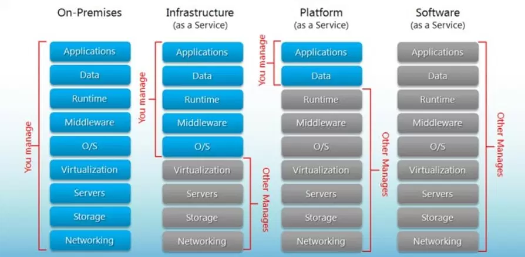

Modern software is a sea of acronyms, abbreviations in addition to the flotsam and jetsam of concentric circles created by overlapping terminologies. This washes over technology organizations with conflation and confusion that is a departure from the utopian ubiquitous language sought after for a frictionless design and development lifecycle.

Perhaps one of the most misunderstood sets of terms includes "infrastructure", "platform" and "distributed systems". At a high-level the differences become hand wavy, sometimes necessarily so in terms of the problem space. However, failure to understand these concepts is a basic faux pas that can derail a product.

Let's start by trying to come up with some basic definitions from which to differentiate.

## Infrastructure

The biggest problem defining infrastructure is that the term has existed, evolved and contradicted itself for nearly the entire history of information technology and the computer science. I've heard anecdotes such as "wall jack to wall jack" or "everything but the application".

Google turned the concept on it's side in 2003-ish when it launched SRE. Suddenly, infrastructure was a software problem, and there became considerable debate about how this changed its scope. Over the next decade or so infrastructure started to fall into loose classifications of on-prem, air-gapped, private cloud, public cloud, hybrid, etc. In addition, with DevOps, infrastructure as a concept was further refactored.

I think [Gartner](http://gartner.com/) provides a nice simple definition that I'm paraphrasing here (while modifying the statement to product-orientation rather than IT):

> Infrastructure is a system of hardware, software, facilities and service components that support the delivery of 
> software product.

Another great definition of infrastructure can be extracted from the cloud-computing concept of Infrastructure-as-a-Service (IaaS)

Based on this visual, let's put a stake in the ground, further refining Gartner's definition above, with the following:

> Infrastructure includes all physical hardware, storage, and networking components as well as an optional 
> virtualization layer. 

## Platform

Without actually doing any polls or collecting official data, I imagine that "platform" is probably one of the top 10 most overused and ambiguous terms in technology.

Given the ambiguity, the history of the term is a bit more haphazard and something of a  erratically choreographed dance across time. While it remains murky, I find that the advent of the Platform-as-a-Service (PaaS) concept has helped tighten it up a bit.

That being said, referencing the previous graphic we can come to the following:

> A platform is a collection of software and systems installed on top of (or embedded into) the Infrastructure for 
> the purposes of supporting an application designed for a given problem space. 

The problem space here may or may not be an external customer. Large organizations

Personally, as a Java geek who loves frameworks like [Micronaut](https://micronaut.io/), [Vert.x](https://vertx.io/),
[Quarkus](https://quarkus.io/) et al., 
this is my favorite area of 
software. 

## Infrastructure vs. Platform

If we refer back to Gartner's definition of Infrastructure, it seems to include platform. However, if we look at the definition of PaaS, it appears to include or encapsulate infrastructure.

This suggests that there is the possibility that the terms can be used interchangeably. The first observation is that variations of both definitions center on the same abstraction point. This demonstrates a clear separation or boundary. However,  in the absence of a well-defined standard it's hard to defend my position with any degree of formality.

When formality fails, I fall back on empirical data. Let's simplify the problem by scaling it down to something easier to grasp.

In order to write this blog, I'm using an application to visit a website (Google Chrome). Google Chrome is the software application. I'm using a MacBook w/ Catalina, the infrastructure and platform respectively.

While Apple provides a unified infrastructure and platform experience, they vary independently. Microsoft and Linux don't provide a unified experience.

If we refer back to the general definitions of infrastructure and platform, infrastructure is always defined as something physical, while platform ambiguously refers to something logical or virtual that "might be physical". In the English language, at the very least, the separation is clear enough to provide ubiquity. 

## Distributed Systems

A distributed system can be infrastructure, platform or both. A distributed system is an end state achieved by applying a set of algorithms, design patterns and concepts to solve problems of scale, reduction of UX variance in terms of geography, etc.

When we discuss distributed systems, we're usually less focused on the "what" and more focused on the "how". Interviews for "systems problems" rarely focus on the actual technology choices, and interviewers tend to weight their grading of candidates based on the thought process to get from point A to point B rather than on the end state.

> "Ed, thanks for that utterly nuanced discussion on these three terms. Why do I care?"

I'm so glad you asked!

I left a few breadcrumbs in my definitions to foreshadow where I'm going with this. Any software driven value stream is primarily concerned with getting a profitable product to their customer base. The degree at which that product solves the customer's problem space and provides enough profit for the organization to perpetuate is tied directly to the hierarchy of components from which that stream is constructed.

The efficacy of an application is often limited by the capabilites of the platform provided to it. The efficacy of that platform is subsequently limited by the infrastructure on top of which it is built .

Successful implementation requires a commanding view of the boundaries in order to provide a clear-cut separation of responsibilities, division of labor and lifecycle independence.

The ideal platform is infrastructure agnostic. This is a major aspect of concerns surrounding vendor-lock in, and one of many factors in multi-cloud implementations where a common platform is built atop multiple disparate infrastructures. 

Understanding this is possibly the most critical when building or guiding teams. Small companies may consist of a single team with (ideally) a balanced collection of these skill sets, whereas larger organizations will probably have separate teams or business segments dedicated to each.

I have seen projects suffer on more than one occasion because these boundaries were misunderstood, underestimate or ignored altogether. This results in extremely hard to solve problems due to an abundance of dependencies bleeding throughout segments or components of a design.

Clarity and the drawing of boundaries can be a design-driven astrolabe guiding us across our software laden journeys. 