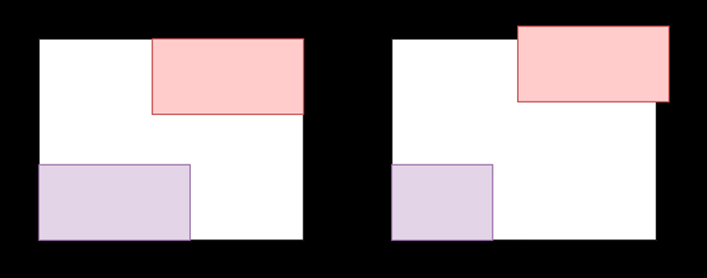

Does the Node Foundation deprecate versions aggressively? (Yes)

Yes, software architects should code. In order to understand why, it's important to understand the career paths and organization of the general aspects of software teams.

Generally speaking, I think that there are three basic career paths one can take in the wild world of software:
1. Individual Contributions in terms of code
1. Individual Contributions in terms of architecture
1. People Management.

## Individual Contributions: The Depth of Development
When most people think of software, they think of the stereotypical programmer. There is a classic stereotype of thick glasses, frail stature, poor people skills and terrible fashion sense. We've come a long way since that perspective. As technology elbowed its way into the mainstream, so did the persona of software developers. Now the stereotype is looser, harder to define, and allows individualism and societal enrichment.

Nonetheless, when we think of software, we think of a person sitting in front of a computer making magic with their fingers and brains.

The reality is that this is an endeavor of depth. Software developers tend to specialize in a specific tech stack or business domain. Over time, they branch out, but in order to grow their craft, it is important to drill through the bedrock of computational knowledge, achieving an ever-deepening command of the tech stack, algorithms, data structures, the constraints and characteristics of their business domain, etc.

A junior Java developer might evolve into a senior developer of JVM-based languages, with expertise in [Spring](https://spring.io/), 
[Hibernate](https://hibernate.org/) and an event-driven architecture. Debugging chops evolve from "insert print statements" to "stepping 
through a call stack".

Fortunately, many tech stacks are built on common attributes of computation. An algorithm or data structures only change slightly from stack to stack based on the semantics and features of the stack. Implementation using the tools of a stack might abstract understanding in different ways, shaping what aspects of the governing dynamics we naturally retain, and those that slip away into obfuscated oblivion.

Growing a career in development has often been stifled by organizational assumptions that to move forward in your career, you must move in to management.

This is troublesome for a number of reasons. I have worked with many developers who are absolutely brilliant and 
have more than earned a "seat at the table". They are influential, thoughtful, and productive. However, people 
management is simply not necessarily among their greater assets. [Facebook](https://www.facebook.com/careers/) is a fantastic example of an 
organization that values these high performers, by creating a career track that breaks through the drop-tile ceiling into higher visibility positions.

Historically, these positions didn't exist in traditional organizations, forcing developers to make the hard decision between staying in an undervalued position, or moving to a management position that they more than likely didn't want and were probably not qualified for. The latter leads to feelings of despondency and potentially a web of depression and frustration.

## People Management: Leading Teams
It makes sense that most developers have to report to someone. While the public still associates software with developers, I'm sure they can reason about the concept that these developers are managed.

While not every developer is cut out for management, some are born leaders. There are many developers who thrive when it comes to mentorship, coaching and acting as a multiplying influence to their peers.

Management requires some understanding of the business, appropriate to the tier of management within the organization It requires an understanding of how to unblock problems, the ability to build strong professional relationships external to their team across an organization in order to advocate on behalf of the team. It requires the ability to help keep team members on track, focused on their specific tasks.

I referred to development as a depth activity. People management is very much about serving the needs of a collection of individuals. I like to think of it as an enablement activity. I don't think it's necessary to define further, because a good leader recognizes what needs to be enabled, and helps ensure that it happens.

In many cases, the skills that require honing aren't technical in nature. Maybe this is a case of time and task management, or interpersonal skills and communication. I think that a good leader understands these skill sets, and is capable of coaching them in order to help drive the needs of the business. However, it is a **_great_** leader who has such mastery over these skills that they may influence change to both drive the needs of the business and grow the careers of those he or she is coaching.

It is worth noting that while many developers came from hands-on backgrounds, there are also many organizations that hire software leadership positions from project management backgrounds. This dives into complexities such as project management vs. technical project management, as well as organizational details that impact hiring, operational model and the prioritization of leadership skills.

## Individual Contributions: Breadth and Butter
We've covered individual contributions in terms of development as well as the management function that keeps the contributors focused and aimed towards the needs of the organization.

So what does an architect do?
> I have no idea what you do. - My Wife

Most people don't know what software architects do. When asked to define it, responses tend to lean towards the general definition of what an architect does.

Sure, this is close enough, but if someone attempts to actually perform the work of a software architect generically, the result will be generic.

If given the requirements to create a wheel, it's entirely possible that a generic solution might be a frisbee.

There are literally books written at a fairly brisk rate (as technical publications go) describing the job function of software architects, so please forgive any license I take to whittle this down for the purposes of brevity.

Architects receive business requirements and participate in clarification and refinement procedures that help translate the language of the business domain to technological concepts. The more we know about technology, the more options we have to solve the problem space summarized by the requirements.

Where as software development is a depth-driven activity, software architecture is a breadth-driven activity. One of the reasons for this is that problem solving isn't a black and white exercise. Many of us have heard the "square-peg, round hole" analogy in terms of failed implementation or design. This is a bit denigrating and often over simplifies the true nature of the problem.

More accurately, the problem may be a parallelogram-like shape with specific dimensions and strange notches throughout the line segments. A solution may have achieved the dimensions, but failed to match each shape characteristic 1:1.

The diagram above reflects a more common "miss" scenario in terms of architecture and requirements. The diagram on the left represents the requirements, and the diagram on the right represents the architecture.

There are only two variations here. I did this deliberately to emphasize the benefit of small batches of work. I could easily put a large UML diagram here, and then lose half of the audience trying to explain the design, which isn't the purpose of the article.

There are a number of reasons why this might happen, some of which might even be deliberate.
- The requirements may represent an ideal that isn't possible in nature. (For instance, the initial requirements may dictate a solution that violates practical tradeoffs such as the Brewer's CAP Theorem).
- Perhaps there is a temporal constraint due to business need to go to market, and the diagram on the right reflects an acceptable deviation in the short term (i.e. Minimum Viable Product - MVP), as long as we continuously approach the state represented on the left.
- Perhaps the architect is inexperienced, and the diagram on the left represents the closest he or she is able to 
  solve the problem given his/her experience and knowledge.
- Maybe this is even just a good old fashioned communication gap between various participants and stakeholders.
- Many Many More.

Architectural decisions are primarily about making comparisons between alternate solutions to problems based on negotiating the tradeoffs to come up with the closest fit to the problem. There are no silver bullet solutions, no one-size-fits-all designs. Many businesses attempt to compete by finding ways to differentiate their products and offerings from competitors within the same space. The very nature of their strategy is to try to redefine the problem space in a manner that makes it more or less attractive than someone else doing the same thing. This means that an architect could leave their job at one company and take another position at a direct competitor, and still have to entirely rethink architectural characteristics and solutions due to the way that the business is approaching the problem.

If you're an architect, then breadth is your butter. (I'm very sorry, I couldn't resist.)

Ultimately, most software architectures are complex systems with many moving parts. In order to navigate the vast array of colors, we have to have a diverse palette from which to paint.

Delivering effective architectures means that architects have to be able to provide
justification for choosing solution A over B, C, and Z. We have to know that they exist, we have to understand the features, and we have to understand how each solution attacks the problem we're attempting to dress. This involves evaluating the presence or lack of features, as well as weighting those features against the business needs.

So what does all of this have to do with coding?

## Don't Get Dumb
Software architectures aren't pretty drawings to be filed away in cabinets or stored on wikis. They want to fly. They want to be implemented. At some point, an architecture has to become tangible (as much as software can be.)

Architects who stop coding altogether get dumb. They forget the details of implementation. They forget the pain and entropy that is associated with maintaining and curating the very systems they are creating. This has a negative effect on the designs, because decisions might become too high level, impractical, or downright impossible.

As an architect steps away from the implementation, they are also stepping away from the ubiquitous language and kinship of software development that connects an architecture to its implementation.

I recently wrote an article about how senior members of engineering teams can easily become bottlenecks. I mentioned ways that architects (or other senior leaders) can extract themselves from ownership of critical components of the code base in order to improve productivity in a development pipeline.

Here, I'm proposing a similar solution, at a higher level. A gradient software engineering team will include engineers of increasing depth and breadth. While depth will always be the foremost important goal of engineers, it is a natural progression to dabble in other tech stacks, frameworks, technological spaces and business domains.

In the same manner, breadth will always be the primary purpose of an architect. In order for architects and engineering teams to collaborate, a virtual handshake is best constructed by the ratios and crossover of depth-to-breadth in a manner that engineering teams can provide enough breadth to understand architects, and architects can maintain enough depth to understand the needs of the developers to whom they provide their designs. What better way to accomplish this, than for architects to write code? (Perhaps using the same suggestions provided in my previous article).

## Postscript: Don't Get Burnt

A word of caution to younger architects is to embrace "breadth as your butter". I have seen many architects attempt to maintain substantial depth to every new technology they learn. Not only does this result in an ineffective balance of skills, but it results in a very fast path to burnout.

(I've seen this to a lesser degree in senior engineers, as there is usually less of a push for them to attain breadth).

It is important to come to a degree of comfortability and acceptance that in the pursuit of gaining new and different skills, or even new perspectives on the same skills (i.e. breadth vs. depth) that there is going to be atrophy and stagnation.

Perhaps, the most challenging question is how to manage and maintain the skills necessary to continue to provide code in a way that doesn't impede your growth and responsibilities as an architect, and doesn't stagnate so sharply as to lose credence with the engineering teams you work with.

I guess I'll have to write another post! 