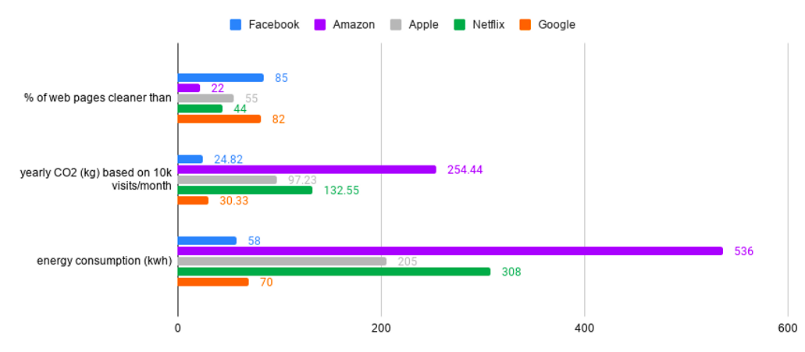

This is a quick note on Sustainable Software Engineering or [Green Software Engineering](https://principles.green/). I'll admit, I prefer the 
latter. The former nomenclature collides with the concept of [sustainability](https://www.amazon.com/Sustainable-Software-Development-Agile-Perspective/dp/0321286081) as an architectural characteristic.

Sweden's [TheGreenWebFoundation](https://www.thegreenwebfoundation.org/) provides additional resources surrounding Green Engineering.

[WebsiteCarbon](https://www.websitecarbon.com/) is a site that allows you to measure the carbon footprint of your website. (Mine doesn't do so well, 
which has me re-evaluating my hosting. As of this writing, it is "dirtier" than ~56% of tested websites). You can also spend some time plugging in well-known sites to see how they fare on this scale. (This is really fun if you have a 
nemesis/competitor whose site is much less eco-friendly than yours. Just kidding.)

Something I found particularly interesting is comparing the organizations of the [FAANG](https://www.investopedia.com/terms/f/faang-stocks.asp). _(NOTE: I ran this test 
successively for 10 days and took the averages. The pages were loaded in incognito mode on Google Chrome, Mozilla Firefox, and Opera. I took the average across each browser and day, but there wasn't much variation. The distribution of  data was fairly clustered). Needless to say, this is just a snapshot. It's a very cursory view._

Facebook and Google were the cleanest sites, although given the nature of the root pages, this has to be taken with a grain of salt. I did test subdomains like the developer sites, open source sites, etc. but the data isn't reflected in the chart above. That being said, I didn't observe all that much difference.

Apple provided a fair middle ground (and probably a less incomplete example, as the root provides more content). Amazon and Netflix didn't do so well. This is also not surprising.

This is a fantastic initiative, but there is substantial impediment. While many software engineers might consider refactoring code to be a laborious task, it pales in comparison to rebuilding physical space. Data Centers.

If every website on the planet optimizes their code to take advantage of the "greenest" features available, it won't matter much if data centers can't support it.

[WHOLEGRAINdigital](https://www.wholegraindigital.com/blog/choose-a-green-web-host/) provided a (non-exhaustive) list of hosting options at the beginning of 2020.

As I search through resources, I notice that there is an abundance of resources for software developers to seek out new data centers and change their code, but there doesn't seem to be much engagement to solve this problem at the root.

Historically, this kind of change has always been an evolution driven by the payers. Consumers prioritize the value of feature 'X', and the producers who remain salient in the market are those who are capable of delivering it.

It might be naive for me to want this, but I hope that we evolve beyond a state that buying power is the greatest impetus for affecting change. I don't want to corrupt this site with political agenda, so I'll stop here. Besides, I've got to find a way to make this site greener. 